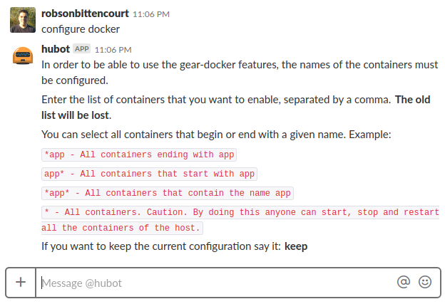

# gear-docker
A Hubot Gear for manage Docker containers

[](https://travis-ci.org/hubot-js/gear-docker)  [](https://www.npmjs.com/package/gear-docker) [](https://david-dm.org/hubot-js/gear-docker)  [](https://david-dm.org/hubot-js/gear-docker?type=dev)

> A Hubot Gear for manage Docker containers

This is a gear to add to hubot.js the ability to manipulate Docker containers. If you do not know the hubot.js or do not know what they are gears like this [click here](https://github.com/hubot-js/hubot.js/blob/master/README.md) for more details.


## Configuration

Some settings are required. They can be made by Slack using the following command:

```
configure docker
```


These settings are stored, so you just need to do them once. But if necessary can make them again.

## Usage

### Restart a container

```
restart containerName
```


### Stop a container

```
stop containerName
```


### Start a container

```
start containerName
```


## Meta
Robson Bittencourt - @rluizv - robson.luizv@gmail.com

Distributed under the MIT license. See [LICENSE](LICENSE) for more information.

https://github.com/hubot-js/gear-docker
